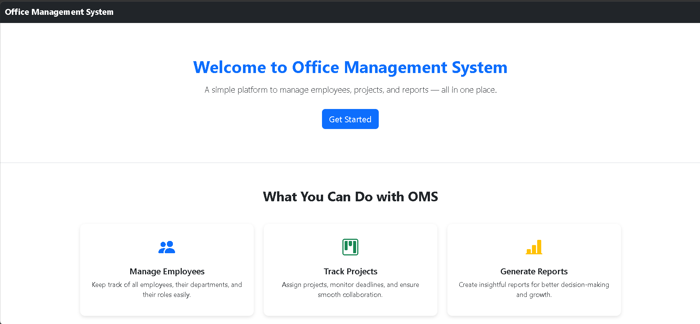
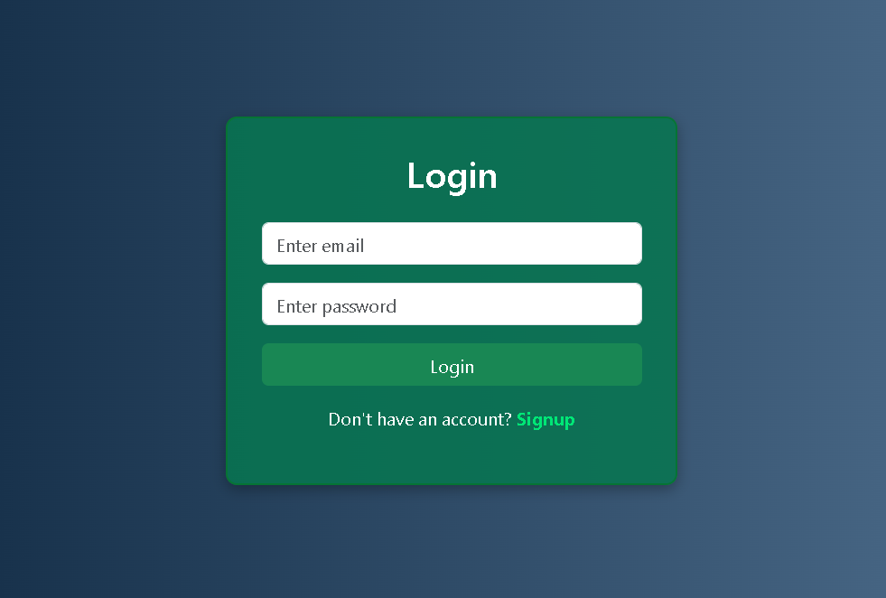
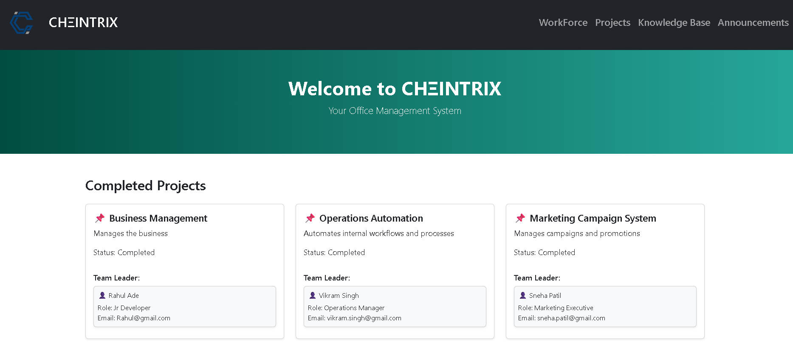
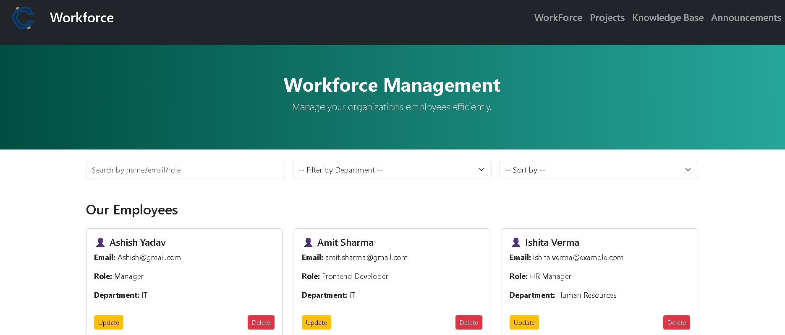
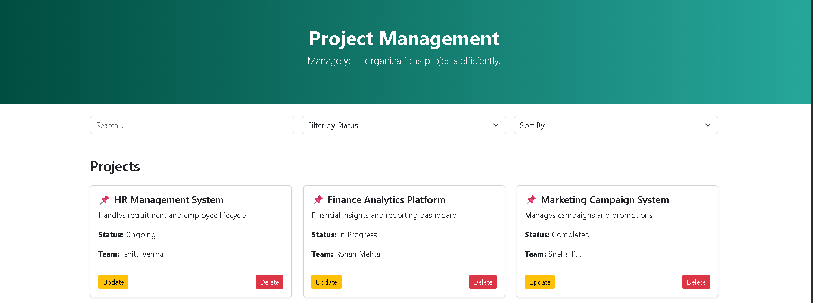
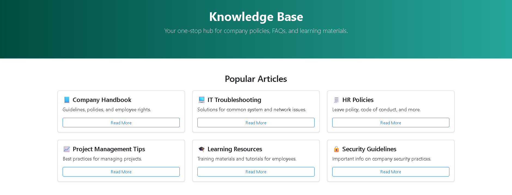
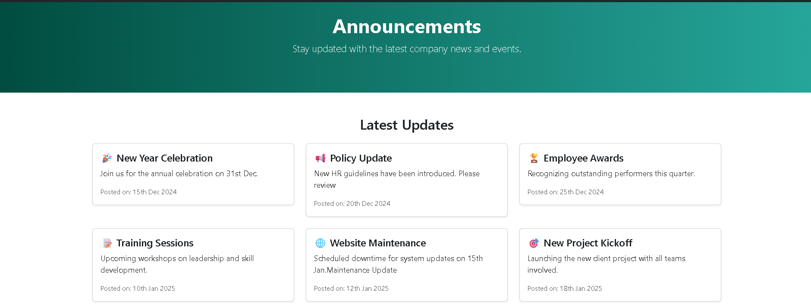

# 🚀 Office Management System

A modern Full Stack Office Management System built using **React JS**, **Spring Boot**, and **MySQL** to streamline office operations, employee management, project tracking, and organizational communication.

---

## 📋 Project Overview

The Office Management System is designed to help organizations manage their workforce, projects, announcements, and knowledge resources through a centralized platform. The system provides an intuitive user interface and secure backend APIs for efficient office administration.

---

## ✨ Features

### 👥 Workforce Management

* Add, update, view, and delete employee records
* Manage employee information efficiently

### 📁 Project Management

* Create and manage projects
* Track project details and assignments

### 📢 Announcements

* Publish office announcements
* Keep employees informed about important updates

### 📚 Knowledge Base

* Store and access organizational resources
* Centralized information repository

### 🏢 Dashboard

* Interactive dashboard for quick insights
* Easy navigation across modules

### 🔐 Authentication & Authorization

* Secure user login
* Protected application routes

### ⚙️ CRUD Operations

* Full Create, Read, Update, and Delete functionality

---

## 🛠️ Tech Stack

### Frontend

* React JS
* Bootstrap 5
* JavaScript (ES6+)
* Axios
* HTML5
* CSS3

### Backend

* Spring Boot
* Java
* Spring Data JPA
* REST API

### Database

* MySQL

### Tools & Technologies

* Git
* GitHub
* Postman
* Maven

---

## 📸 Project Screenshots

### First Page



### Login Page



### Home Page



### Workforce Management



### Project Management



### Knowledge Base



### Announcements



---

## ⚙️ Installation & Setup

### Clone Repository

```bash
git clone https://github.com/Shomaydubey23/oms-frontend.git
cd oms-frontend
```

### Frontend Setup

```bash
npm install
npm start
```

Application will run at:

```bash
http://localhost:3000
```

---

## Backend Setup

```bash
mvn clean install
mvn spring-boot:run
```

Backend server will run at:

```bash
http://localhost:8080
```

---

## 📂 Project Modules

* Login & Authentication
* Dashboard
* Workforce Management
* Project Management
* Knowledge Base
* Announcements

---

## 🎯 Future Enhancements

* Role-Based Access Control
* Report Generation
* Attendance Management
* Leave Management
* Email Notifications
* Analytics Dashboard

---

## 👨‍💻 Author

**Shomay Dubey**

* Full Stack Java Developer
* React JS Developer
* Spring Boot Enthusiast
